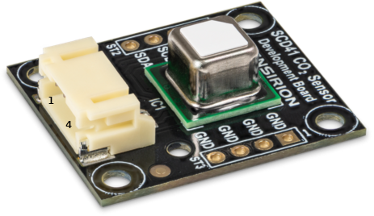
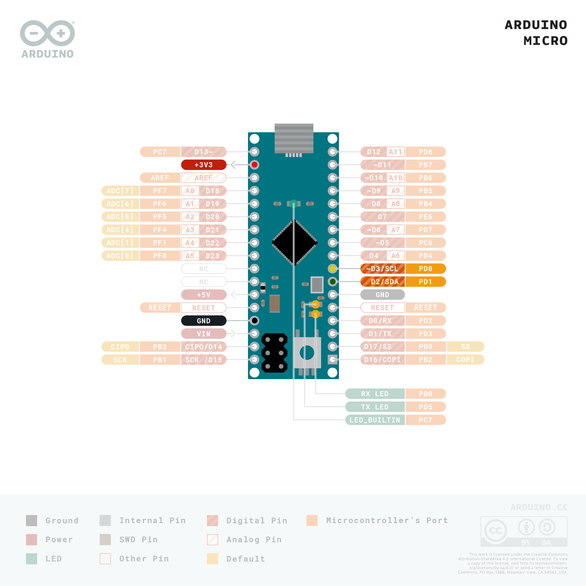

# Sensirion I²C SCD4X Arduino Library

This is the Sensirion SCD4X library for Arduino allowing you to
communicate with a sensor of the SCD4X family over I²C.



Click [here](https://sensirion.com/products/catalog/SEK-SCD41) to learn more about the Sensirion SCD4X sensor family.


Not all sensors of this driver family support all measurements.
In case a measurement is not supported by all sensors, the products that
support it are listed in the API description.


## Supported sensor types

| Sensor name   | I²C Addresses  |
| ------------- | -------------- |
|[SCD40](https://sensirion.com/products/catalog/SCD40)| **0x62**|
|[SCD41](https://sensirion.com/products/catalog/SCD41)| **0x62**|
|[SCD43](https://sensirion.com/products/catalog/SCD43)| **0x62**|

The following instructions and examples use a *SCD41*.


## Installation of the library

This library can be installed using the Arduino Library manager:
Start the [Arduino IDE](http://www.arduino.cc/en/main/software) and open
the Library Manager via

`Sketch` ➔ `Include Library` ➔ `Manage Libraries...`

Search for the `Sensirion I2C SCD4X` library in the `Filter
your search...` field and install it by clicking the `install` button.

If you cannot find it in the library manager, download the latest release as .zip file
and add it to your [Arduino IDE](http://www.arduino.cc/en/main/software) via

`Sketch` ➔ `Include Library` ➔ `Add .ZIP Library...`

Don't forget to **install the dependencies** listed below the same way via library
manager or `Add .ZIP Library`

#### Dependencies
* [Sensirion Core](https://github.com/Sensirion/arduino-core)

## Connect the sensor

Use the following pin description to connect your SCD4X to the standard I²C bus of your Arduino board:


| *Pin* | *Cable Color* | *Name* | *Description*  | *Comments* |
|-------|---------------|:------:|----------------|------------|
| 1 | yellow | SCL | I2C: Serial clock input |
| 2 | black | GND | Ground |
| 3 | red | VDD | Supply Voltage | 2.4V to 5.5V
| 4 | green | SDA | I2C: Serial data input / output |


The recommended voltage is 3.3V.

### Board specific wiring
You will find pinout schematics for recommended board models below:


<details><summary>Arduino Uno</summary>
<p>

| *SCD4X* | *SCD4X Pin* | *Cable Color* | *Board Pin* |
| :---: | --- | --- | --- |
| SCL | 1 | yellow | D19/SCL |
| GND | 2 | black | GND |
| VDD | 3 | red | 3.3V |
| SDA | 4 | green | D18/SDA |


</p>
</details>


<details><summary>Arduino Nano</summary>
<p>

| *SCD4X* | *SCD4X Pin* | *Cable Color* | *Board Pin* |
| :---: | --- | --- | --- |
| SCL | 1 | yellow | A5 |
| GND | 2 | black | GND |
| VDD | 3 | red | 3.3V |
| SDA | 4 | green | A4 |


</p>
</details>


<details><summary>Arduino Micro</summary>
<p>

| *SCD4X* | *SCD4X Pin* | *Cable Color* | *Board Pin* |
| :---: | --- | --- | --- |
| SCL | 1 | yellow | ~D3/SCL |
| GND | 2 | black | GND |
| VDD | 3 | red | 3.3V |
| SDA | 4 | green | D2/SDA |



</p>
</details>


<details><summary>Arduino Mega 2560</summary>
<p>

| *SCD4X* | *SCD4X Pin* | *Cable Color* | *Board Pin* |
| :---: | --- | --- | --- |
| SCL | 1 | yellow | D21/SCL |
| GND | 2 | black | GND |
| VDD | 3 | red | 3.3V |
| SDA | 4 | green | D20/SDA |


</p>
</details>


<details><summary>ESP32 DevKitC</summary>
<p>

| *SCD4X* | *SCD4X Pin* | *Cable Color* | *Board Pin* |
| :---: | --- | --- | --- |
| SCL | 1 | yellow | GPIO 22 |
| GND | 2 | black | GND |
| VDD | 3 | red | 3V3 |
| SDA | 4 | green | GPIO 21 |


</p>
</details>


## Quick Start

1. Install the libraries and dependencies according to [Installation of the library](#installation-of-the-library)

2. Connect the SCD4X sensor to your Arduino as explained in [Connect the sensor](#connect-the-sensor)

3. Open the `exampleUsage` sample project within the Arduino IDE:

   `File` ➔ `Examples` ➔ `Sensirion I2C SCD4X` ➔ `exampleUsage`


   The provided example is working with a SCD41, I²C address 0x62.
   In order to use the code with another product or I²C address you need to change it in the code of `examples/exampleUsage`.
   You find the list with pre-defined addresses in `src/SensirionI2CSCD4X.h`.


5. Click the `Upload` button in the Arduino IDE or `Sketch` ➔ `Upload`

4. When the upload process has finished, open the `Serial Monitor` or `Serial
   Plotter` via the `Tools` menu to observe the measurement values. Note that
   the `Baud Rate` in the used tool has to be set to `115200 baud`.

## Contributing

**Contributions are welcome!**

This Sensirion library uses
[`clang-format`](https://releases.llvm.org/download.html) to standardize the
formatting of all our `.cpp` and `.h` files. Make sure your contributions are
formatted accordingly:

The `-i` flag will apply the format changes to the files listed.

```bash
clang-format -i src/*.cpp src/*.h
```

Note that differences from this formatting will result in a failed build until
they are fixed.
:

## License

See [LICENSE](LICENSE).